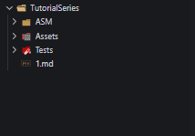

# Emulated CPU - Part 1: Intro

In this series I will walk through on how to make a simple computer to print hello world to a emulated LCD display.

## Contents

> Note: If you already have an understanding of the Python language, and a good work environment, skip to section [4.0: Plan](#40-plan)

- **Intro**
  - [1.0: Introduction](#10-introduction)
  - [2.0: Requirements](#20-requirements)
  - [3.0: Setup](#30-setup)
  - [4.0: Plan](#40-plan)
- **RAM**
- **CPU**
- **ASM**
- **LCD**
- **Consclusion**

## 1.0 Introduction

This series will go through similar steps as [Ben Eater's series](https://www.youtube.com/watch?v=LnzuMJLZRdU&t=708s).

You will also be making a simple assembler, LCD Emulator, and most importantly, the CPU Emulator.

## 2.0 Requirements

You will need at least a basic understanding of the Python langauge, though I have personally recreating this project in C# and C++, so following along in a different language should be easy.

Even if you know nothing about how computers work, you can follow along! I am plannig on explaining everything very in depth.

You should probably also have a nice work environment, in this series I will be using VSCode with some extensions to help out. You should also have these extensions if your working with VSCode:

- Python
- x86 and x86_64 Assembly
- Visual Studio IntelliCode

## 3.0 Setup

You should setup your workspace clearly so you don't have tons of files in the same directory. I had 3 folders to contain specific files.

| Folder Name | Contains | |
|-|-|-|
| ASM | Used to hold the assembler files | |
| Assets | Only contains icon for LCD Emulator | (Optional) |
| Tests | Tests for the project | (Optional) |
|

## 4.0 Plan

What exactly are we going to be making?

|||
|-|-|
| RAM | Small 64kb virtual memory |
| CPU | Simple emulated CPU inspired by the 6502 |
| LCD | Emulated LCD screen with simple interal CPU using pygame |
| ASM | Small assembler to assembled programs, custom syntax |
|
